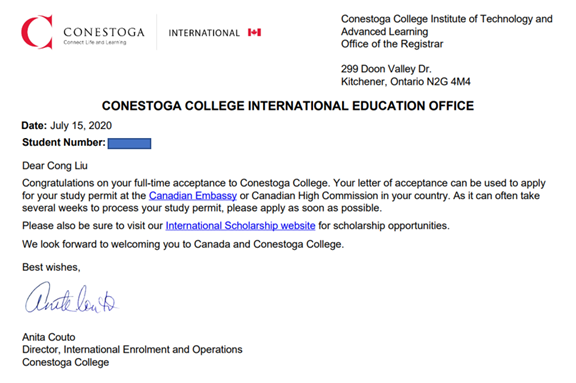
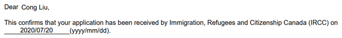
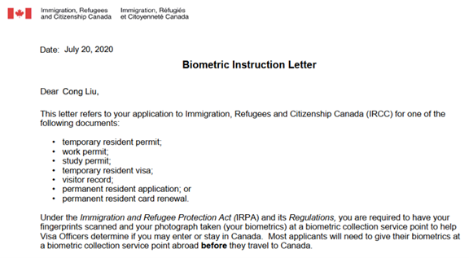
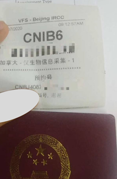
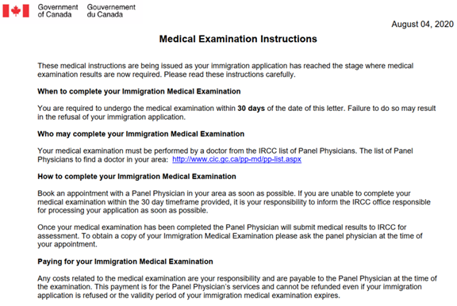
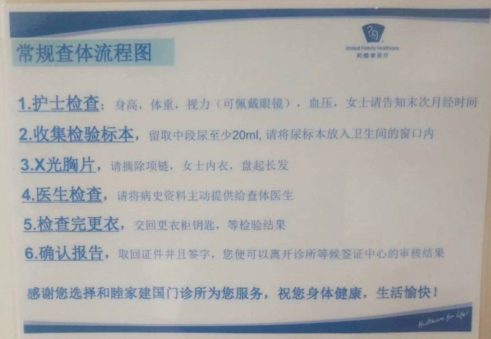
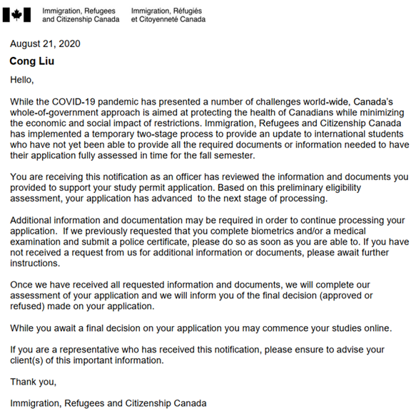
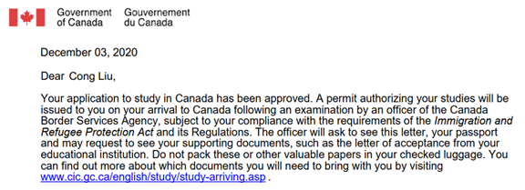

### 起因

大学毕业前最后一次喝酒，我得知隔壁同班同学要跨专业考计算机研究生。酒过三巡，我脑子一热，提出跟他一起考。他劝我冷静，问问自己有多喜欢计算机，愿意为它付出多少？我没有考计算机研……

四年后的某天，在望京，老友久别重逢。他这些年的经历——考研名列前茅、微软实习、进入大厂——让我深深地替他高兴。他当年的选择无疑是正确的，而我的退缩使我错失机遇。关于要不要学计算机，重谈此话题，彼此都已非当年的热血青年，考虑问题的角度也更加全面。这些年我不断反思总结最适合自己的人生轨迹，渐渐萌生了去加拿大学计算机的念头，而且我也做足了准备工作。但苦于一直遭到家里人反对，心里很郁闷。

兄弟劝我：“选定一个目标，努力实现它。即使发现终点不完美，也是进步了而非原地踏步。不要因为别人的话而改变目标。“ ”有一刻发现自己的天花板变得特别高：研一开学没多久，专业课老师对所有学生说，你们以后起薪都是年薪20万，后来发现老师说少了。“ 我惭愧万分，原来我性格里的优柔寡断正是我失败的原因。我意识到我不能拖延了，也没拖延的资本。我必须马上行动，否则等待我的将是万劫不复。

回首往事，这场酒无疑是我人生的转折点。假如我所有的搜集信息、提升英文、自学计算机基础等准备工作算作我申请成功因素的百分之九十九，那他这次醍醐灌顶的话就是剩下的百分之一。星星之火，可以燎原。水烧到九十九度是不会开的，少一度也不行。那天开始，我就像烧开了的水，还像被大火席卷的平原，内心所有的疑虑都消失了，思维无比的清明，能清晰看到我心里想要的是什么。我只看到一件事，一直想做却不敢做的事。我下定决心要扫清一切的障碍，全力以赴地去完成此事。

当晚，即2020年6月21日凌晨1点，回到挂甲屯，我在白板上写下了：“Apply to study at Canada"(申请去加拿大学习)。从那一刻起，梦想渐渐变成现实……

### 经过

当时我决心尽快入学，即申9月的项目，但考虑到签证和学校的处理时间，已经来不及了。联系到学校的招生老师，答复：“希望虽渺茫，试试且无妨。记住，事在人为。”于是，我立刻制定了计划表，规划了申请过程的每个步骤。因为拿到加拿大任何一所学校offer是申请签证的前提，而签证审核的时间非常漫长，所以我的第一步是尽快拿到offer。在七月初我一边搜集签证材料，一边和老师沟通，确认申请细节。7月5日，在加拿大安省国际招生网站付了一百加币的申请费，提交了本科毕业证、成绩单和托福成绩。说来惭愧，我的托福考了四次才考到88分，而当时我申请的专业要求托福的最低分数就是88分。7月15日，学校给我发了offer：

我立刻开始了学签的申请。这里的立刻，是真的玩命，我在一天内整理好了所有的文件。7月20日，在加拿大移民局网站提交了所有材料，申请费150元加币，约合人民币760块。

21日，收到采集指纹的通知，不过我22号晚上才打开系统看到。电话预约好时间。7月24日，我一早前往中汇广场，采集指纹，指纹有效期十年。

8月3日，收到体检通知。第二天我起早饿着肚子前往和睦家医院，体检费1700元人民币，整颗心在滴血有木有！

8月21日，通过第一阶段。

当时移民局的政策是只要拿到第一阶段学签，就可以合法的上网课了。即使人在中国，上网课的时间也会被计算在加拿大留学生身份时长当中。而只要学习时间满两年，绝大多数人在毕业后都会得到为期三年的开放工作签证。这种毕业后工作签证是针对于留学生设置的，**每个人一生只能申请一次**。等待学签的整个过程，我都是提心吊胆的。一方面，学签其实是有一定被拒签的概率的，我的成功很大程度归功于写得不错的学习计划。另一方面，我的批复速度算是比较快的，从提交到通过差不多一个月。

### 结果

从9月开学起，白天上班，晚上上课，一直等到了12月初才收到正式的学签。按照说明寄出护照，等了一周就收到了贴签。

至此，全部申请过程结束，包括学校的申请和学签的申请。整个过程有心酸，有熬夜，有喜悦，真的是很锻炼人的韧性。早些时候，移民局规定至少50%的课程要在加拿大境内完成，即使是网课。2021年1月我回到了东北老家，全心全意地上网课。原计划我在四月底出国，也就是我第一个项目结束时。但是在大年初一移民局发布新政策，全部课程都可以在线学习，毕业时也符合工作签证的要求。这下子，对比加拿大庞大的生活开销和居家学习的舒适便捷，俺入境加拿大的时间恐怕是要一拖再拖了……省了十万生活费它不香么？
