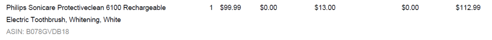
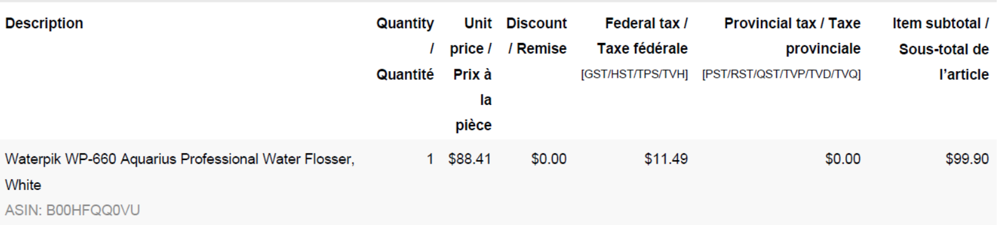

Recently, I bought some cool staff for improving my oral health. For example, the Electric Toothbrush and the Water Floss bought on Aug 3rd, 2022.

The reason being that after meeting up with doctors at RiteBite, I was told that my oral hygiene is too bad to wear braces. Therefore, I first booked two appointments at a local family dentist for teeth cleaning. Then, I was planning to clean my teeth more carefully and professionally for the coming few months.

## Electric Toothbrush

This product has a pressure sensor that protects teeth and gums from excess brushing pressure. Brush heads wear out over time. It tracks how long you have been using your brush head and how hard you have been brushing. It will beep to inform you when to replace your brush head. The battery charge indicator light lets you know when it is time recharge.

I ordered it on Amazon.ca. It cost me $112.99 including taxes.

## Water Floss

This product helps remove plaque and debris from deep between teeth and below the gumline where brushing and traditional flossing can't reach, helping to prevent bad breath, gum disease, and tooth decay.

I ordered it on Amazon.ca. It cost me $99.9 including taxes.

