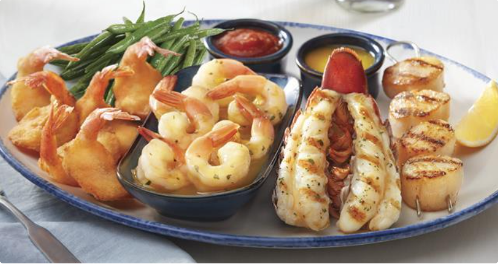

Today I had a meal with my friend at Red Lobster.

We've ordered a **dinner for two** package, including **Seafarer's Feast**.

- A broiled Maritime lobster tail, 
- seared sea scallops, 
- garlic shrimp and Walt's Favourite Shrimp. 
- Served with melted butter, lemon, cocktail sauce 
- and choice of side.

For the drink, we ordered **Piña colada**, which I feel was like 20% milk, 20% Pineapple, 10% sugar, 10% ice, and 40% water.

